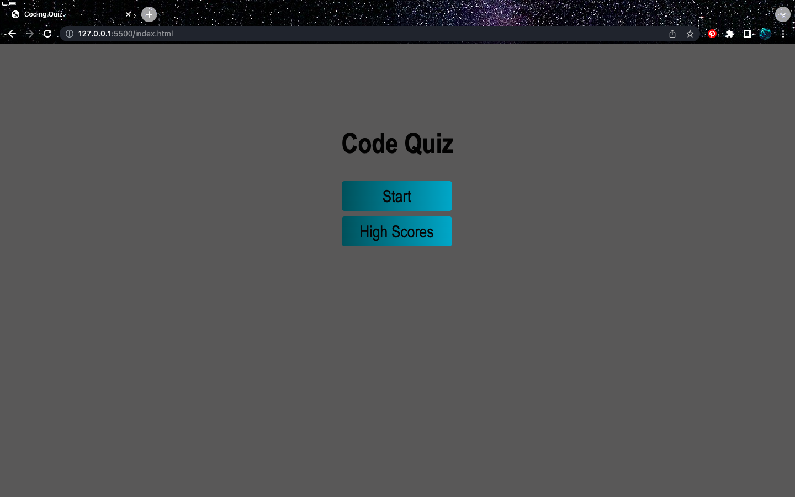

# <Code-Quiz>

## Description

Created HTML, CSS, and JavaScipt files and applied learned concepts to create a 5 question JavaScript quiz game. Users will find a home page, where they will hit "Start Quiz" and it will take them to the quiz page. The user will have 30 seconds to answer all 5 questions. If the user answers correctly, they will receive 20 points per question. Once the quiz is completed, the user will be directed to the High Scores page where they can enter their name.

## Code and Tech

I utilized VS Code in order to create HTML, CSS, and JS files to create a functioning application. 

## Features

Applied functions and concepts recently learned to create a quiz game. 

User hit the start button and the quiz will begin. 

-The timer begins counting down when the first question appears
-User selects an answer and is awarded 20 points if correct
-Qurstions cycle through after each choice is made
-Ends at High Scores page
-High Scores page linked to Home page

## Mock-Up

The user can click the "Start Quiz" button to play the quiz game
The webpage can be found at 
https://taylor-green.github.io/Password-Generator/

## License

MIT License

Copyright (c) [2023] [TaylorGreen]

Permission is hereby granted, free of charge, to any person obtaining a copy
of this software and associated documentation files (the "Software"), to deal
in the Software without restriction, including without limitation the rights
to use, copy, modify, merge, publish, distribute, sublicense, and/or sell
copies of the Software, and to permit persons to whom the Software is
furnished to do so, subject to the following conditions:

The above copyright notice and this permission notice shall be included in all
copies or substantial portions of the Software.

THE SOFTWARE IS PROVIDED "AS IS", WITHOUT WARRANTY OF ANY KIND, EXPRESS OR
IMPLIED, INCLUDING BUT NOT LIMITED TO THE WARRANTIES OF MERCHANTABILITY,
FITNESS FOR A PARTICULAR PURPOSE AND NONINFRINGEMENT. IN NO EVENT SHALL THE
AUTHORS OR COPYRIGHT HOLDERS BE LIABLE FOR ANY CLAIM, DAMAGES OR OTHER
LIABILITY, WHETHER IN AN ACTION OF CONTRACT, TORT OR OTHERWISE, ARISING FROM,
OUT OF OR IN CONNECTION WITH THE SOFTWARE OR THE USE OR OTHER DEALINGS IN THE
SOFTWARE.